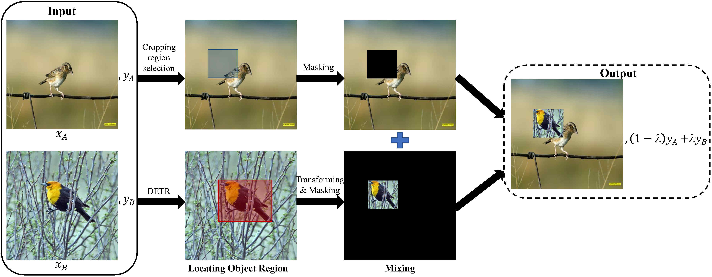

# Detection Transformer can be Used as a Data Augmenter

PyTorch implementation of DeMix | [paper](https:xxx)

## Method Overview



## Setup

### Install Package Dependencies

```
pip install -r requirements.txt
```

### Datasets

***download required fine-grained datasets: CUB-200-2011, Stanford-Cars, FGVC-Aircraft***

### DETR detection

```
python datasets/dataset_process.py
```

## Training
```
python demix.py
    --dataset='cub' # ['cub', 'car', 'aircraft']
    --netname='resnet18' # ['resnet18', 'resnet34', 'resnet50', 'resnet101', 'inception_v3', 'densenet121']
    --mixmethod='detrmix' # ['detrmix', 'saliencymix', 'mixup', 'cutmix']
    --pretrained=1 # if training from scratch, set pretrained=0
```

## Acknowledgment

This code is based on the [SnapMix](https://github.com/Shaoli-Huang/SnapMix.git).

## Contact

If you have any questions or suggestions, please feel free to contact wangluping/liubin@zhejianglab.com.